# Zero-Friction Personal ERP: Feature & UI/UX Freeze Brief

> **Role & Perspective**: Lead Product Manager (Strict & Critical)  
> **Status**: **100% SIGNED OFF & LOCKED FOR CODE EXECUTION (Version 4.0 Final)**  
> **Design Theme**: Bone White (#FBF9F5) + Soft Black (#1A1A1A) + Borderless Cards + Typography-First + Info Tooltips `(i)`  

---

## 1. Executive Summary & Final Sign-Off

**Zero-Friction Personal ERP** is fully specified and locked. All 13 strategic, functional, and design decisions have been scrutinised, benchmarked, and signed off by the Lead Product Manager and User.

---

## 2. Complete 13 Confirmed & Frozen Decisions Matrix

| Decision ID | Domain | Selected Option | Business & Technical Impact |
| :--- | :--- | :--- | :--- |
| **DEC-01** | Data Grid Engine | **Option 1A (`@tanstack/react-table`)** | WCAG 2.2 Level AA keyboard-navigable grid with server-side sorting, pagination, and column filtering. |
| **DEC-02** | Ingestion Staging | **Option 2A (Inbox-First Buffer)** | Webhooks & AI receipts land in `Inbox` staging. Exact rule matches auto-approve; ambiguous items require 1-click review. |
| **DEC-03** | Frontend Routing | **Option 3A (Modular App Router)** | Monolithic `page.tsx` split into Next.js App Router domains (`/overview`, `/inbox`, `/transactions`, `/wallets`, `/budgets`, `/reimbursements`, `/analytics`, `/settings`). |
| **DEC-04** | Transfer Mechanics | **Option 1B (Single Record Transfer)** | Wallet transfers use a single atomic transaction with explicit `from_wallet_id`, `destination_wallet_id`, and `admin_fee`. |
| **DEC-05** | Reimbursement Tracking | **Option 2A (Asset / Pending Claim)** | Office/shared expenses paid with personal funds are marked `is_reimbursement = true` and excluded from personal monthly cashflow expense totals. |
| **DEC-06** | Budget Rollover Policy | **Option 3B (Zero-Based Budgeting)** | Unspent category budget resets to 0 monthly, preventing false carry-over inflation. |
| **DEC-07** | AI Receipt Threshold | **Option 4B (100% Inbox Verification)** | 100% of Gemini AI-parsed receipts MUST enter `Inbox` for 1-click user verification before committing to the ledger. |
| **DEC-08** | Ingestion Payload | **Option 1A (Multimodal Image Ingestion)** | Accepts raw JPEG/PNG base64 images directly from iPhone shortcuts into Go backend for Gemini Multimodal AI processing. |
| **DEC-09** | Transfer Fee Debit | **Option 2A (Atomic Fee Debit)** | Source wallet is debited total `amount + fee`; `fee` is automatically recorded as `Expense: Biaya Admin Bank`. |
| **DEC-10** | Card Accessibility | **Option 3A (WCAG Background Contrast)** | `#F0EEE9` vs `#FBF9F5` background contrast + `focus-visible:ring-2 focus-visible:ring-[#4F46E5]` focus outlines. |
| **DEC-11** | Image File Retention | **Option 1A (30-Day Auto Cleanup)** | Uploaded screenshot files in `backend/uploads/` are cleaned up automatically after 30 days. |
| **DEC-12** | Inbox Error Handling | **Option 2A (Direct Edit & Approve)** | 1-click `Edit & Setujui` button in `/inbox` for quick OCR correction without forcing DLQ rejection. |
| **DEC-13** | Income Auto-Split | **Option 3A (Income Split Dialog)** | Approving income transactions displays an optional dialog to auto-allocate funds across budget categories. |

---

## 3. UI/UX Design System Specification

- **Color Tokens**:
  - Base Background: Bone White (`#FBF9F5`)
  - Card / Surface: Soft Warm Ivory (`#F0EEE9`), Borderless (`border-none`)
  - Text Primary: Soft Black (`#1A1A1A`)
  - Text Secondary: Deep Charcoal (`#5A5A5A`)
  - Focus Ring: Indigo (`#4F46E5`)
- **Typography & Numbers**: `Inter` / `Geist` font family with tabular numbers (`font-variant-numeric: tabular-nums`).
- **Info Tooltip `(i)` System**: Friendly UI labels backed by accessible Info Tooltips explaining financial terms.

---

## 4. End-to-End Workflow Architecture

```mermaid
flowchart TD
    A["iPhone Screenshot (JPEG/PNG / OCR Text)"] --> B["Go API (/api/v1/webhooks/ingest)"]
    B --> C["Log Webhook Event & 30-Day Image Store"]
    C --> D{"Exact Pattern Rule Match?"}
    D -->|"Yes (Confidence = 1.0)"| E["Approved Transactions Ledger"]
    D -->|"No / AI Parsed (Confidence != 1.0)"| F["Gemini Multimodal AI Parser"]
    F --> G["Kotak Masuk / Inbox Staging"]
    G -->|"1-Click Approve / Edit & Approve"| E
    G -->|"Income Approved"| H["Optional Income Distribution Dialog"]
    E --> I["Derived Wallet Balances"]
    E --> J["Zero-Based Budget Tracker"]
    E --> K["Piutang / Reimbursements Claim Ledger"]
```

