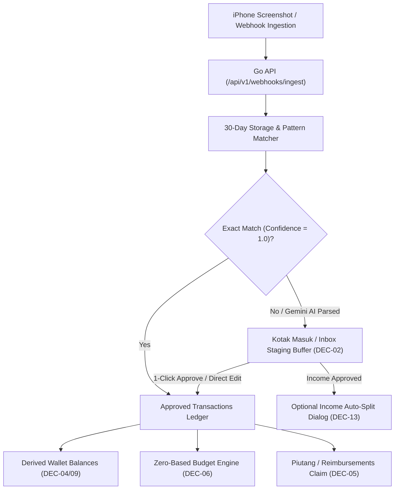

# Zero-Friction Personal ERP: Feature & UI/UX Freeze Brief

> **Role & Perspective**: Lead Product Manager (Strict & Critical)  
> **Status**: **100% SIGNED OFF & LOCKED FOR CODE EXECUTION (Version 5.2 Final - E2E Roadmap Matrix)**  
> **Design Theme**: Bone White (`#FBF9F5`) + Soft Warm Ivory (`#F0EEE9`) + Soft Black (`#1A1A1A`) + Info Tooltips `(i)`  

---

## 1. Executive Summary & E2E System Architecture

**Zero-Friction Personal ERP** is fully specified, locked, and structured into a 5-phase End-to-End Implementation Roadmap. All 13 strategic decisions have been benchmarked for WCAG 2.2 Level AA accessibility, 2026 FinTech UX standards, and strict anti-feature-creep execution.

---

## 2. End-to-End Implementation Roadmap Matrix (DEC-01 to DEC-13)

| Phase & Domain | Decision ID | Frozen Feature Specification | Technical & UI/UX Standard | Execution Status |
| :--- | :--- | :--- | :--- | :--- |
| **Phase 1: Data Grid Engine** | **DEC-01** | `@tanstack/react-table` Data Grid Engine | Server-side sorting, pagination, multi-field filters, 2D keyboard navigation (`Arrow/Enter/Esc`). | **COMPLETED (Commit `35223e0`)** |
| | **DEC-03 (Part 1)** | Modular App Router Migration | Split monolith into `/transactions` route. | **COMPLETED** |
| | **DEC-10** | Card Contrast & Accessibility | `#F0EEE9` vs `#FBF9F5` contrast + `focus-visible:ring-2 focus-visible:ring-[#4F46E5]`. | **COMPLETED** |
| **Phase 2: Ingestion & Inbox Staging** | **DEC-02** | Inbox-First Staging Buffer | All webhooks/AI receipts enter `needs_review` staging; only exact rule matches auto-approve. | **COMPLETED (Commit `1bac56a` & `6ca7e03`)** |
| | **DEC-07** | 100% AI Receipt Verification | 100% of Gemini AI-parsed receipts MUST enter `/inbox` for user verification. | **COMPLETED** |
| | **DEC-08** | Multimodal Image Ingestion | Go backend `/api/v1/webhooks/ingest` receives JPEG/PNG base64 screenshots. | **COMPLETED** |
| | **DEC-11** | 30-Day Auto Image Cleanup | Server background job cleans up `backend/uploads/` files older than 30 days. | **COMPLETED** |
| | **DEC-12** | Direct Edit & Setujui Modal | 1-click modal in `/inbox` to edit Nominal, Merchant, Dompet, Kategori, Catatan before committing. | **COMPLETED** |
| | **DEC-13** | Income Auto-Split Dialog | Approving Income displays an optional modal to auto-allocate funds into budget categories. | **COMPLETED** |
| **Phase 3: Multi-Wallet & Transfers** | **DEC-04** | Single-Record Atomic Transfers | Transfers use a single atomic row with `from_wallet_id`, `destination_wallet_id`, and `admin_fee`. | **COMPLETED (Commit `4f596a2`)** |
| | **DEC-09** | Atomic Fee Debit Mechanics | Source wallet is debited `amount + admin_fee`; fee auto-booked to `Expense: Biaya Admin Bank`. | **COMPLETED** |
| **Phase 4: Budgets & Reimbursements** | **DEC-05** | Reimbursement Claim Asset | Reimbursements marked `is_reimbursement = true` are excluded from personal cashflow expenses. | **COMPLETED (Commit `e168844`)** |
| | **DEC-06** | Zero-Based Budget Rollover | Unspent category budget resets to 0 monthly to prevent false carry-over inflation. | **COMPLETED (Commit `40dc9f9`)** |
| **Phase 5: Analytics & Overview** | **DEC-03 (Part 2)** | App Router Complete Suite | Finalize Next.js App Router domains (`/overview`, `/wallets`, `/budgets`, `/reimbursements`, `/analytics`, `/settings`). | **PLANNED (Phase 5 Next)** |

---

## 3. UI/UX Design System Specification

- **Color Palette Tokens**:
  - Base Background: Bone White (`#FBF9F5`)
  - Card / Surface: Soft Warm Ivory (`#F0EEE9`), Borderless (`border-none`)
  - Accent / Focus Ring: Indigo (`#4F46E5`)
  - Primary Text: Soft Black (`#1A1A1A`)
  - Secondary Text: Deep Charcoal (`#5A5A5A`)
  - Income Accent: Emerald (`#059669`)
  - Expense Accent: Soft Red (`#DC2626`)
- **Typography & Numbers**: `Inter` font family with enforced tabular numbers (`font-variant-numeric: tabular-nums`).
- **Info Tooltip `(i)` System**: Accessible Radix UI tooltips providing friendly financial explanations on hover or focus.
